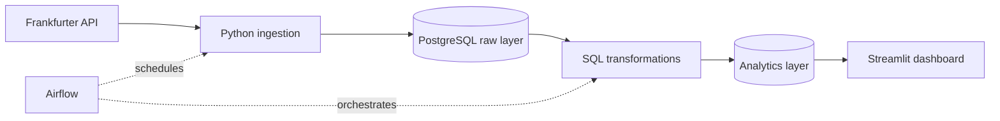

# Currency Exchange Rate Analytics Platform

An end-to-end data engineering project that extracts exchange-rate data from the
Frankfurter API, stores it in PostgreSQL, builds analytical datasets with SQL,
orchestrates the pipeline with Airflow, and presents the results in Streamlit.

## MVP scope

- Base currency: `EUR`
- Quote currencies: `USD`, `GBP`, `NZD`, `AUD`, `JPY`
- Historical backfill plus daily incremental ingestion
- Analytics: daily return, 7/30-day rolling volatility, anomaly flags
- Interactive filters for currency pair and date range
- Local one-command environment with Docker Compose

Authentication, cloud deployment, forecasting, and alerting are outside the
first MVP.

## Architecture



## Planned project structure

```text
.
├── dags/                   # Airflow DAGs
├── dashboard/              # Streamlit application and SQL queries
├── data/sample/            # Small, version-controlled sample data
├── docs/                   # Architecture, data model, and screenshots
├── notebooks/              # Optional exploratory analysis
├── sql/
│   ├── ddl/                # Database schema definitions
│   └── transformations/    # Analytics transformations
├── src/
│   ├── database/           # Database connection helpers
│   ├── ingestion/          # API extraction and loading
│   ├── transformation/     # SQL execution
│   ├── utils/              # Configuration and logging
│   └── validation/         # Data-quality rules
└── tests/                  # Automated tests
```

## Delivery stages

- [x] 1. Define the MVP and scaffold the repository
- [ ] 2. Build and test API ingestion
- [ ] 3. Add PostgreSQL storage and idempotent loading
- [ ] 4. Add validation and data-quality checks
- [ ] 5. Build SQL analytical models
- [ ] 6. Build the Streamlit dashboard
- [ ] 7. Automate the pipeline with Airflow
- [ ] 8. Complete Docker integration, tests, and portfolio documentation

## Status

Stage 1 is complete. The next task is to inspect the Frankfurter API response
and implement a small, testable API client.

