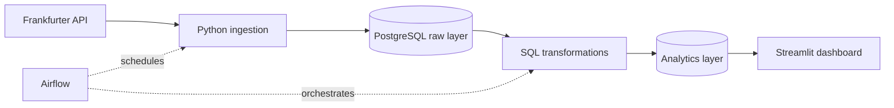
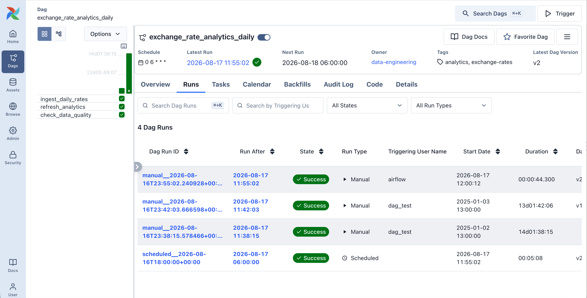

# Currency Exchange Rate Analytics Platform

An end-to-end data engineering project that extracts exchange-rate data from the
Frankfurter API, stores it in PostgreSQL, builds analytical datasets with SQL,
orchestrates the pipeline with Airflow, and presents the results in Streamlit.

## MVP scope

- Base currency: `EUR`
- Quote currencies: `USD`, `GBP`, `NZD`, `AUD`, `JPY`
- Historical backfill plus daily incremental ingestion
- Analytics: daily return, 7/30-day rolling volatility, anomaly flags
- Interactive filters for currency pair and date range
- Local one-command environment with Docker Compose

Authentication, cloud deployment, forecasting, and alerting are outside the
first MVP.

## Architecture



## Project structure

```text
.
├── docker-compose.yml      # Local services
├── requirements.txt        # Python dependencies
├── dags/                   # Airflow DAG
├── dashboard/              # Streamlit application and SQL queries
├── data/                   # Local raw and version-controlled sample data
├── docs/                   # Architecture, data model, and screenshots
├── notebooks/              # Exploratory analysis
├── sql/
│   ├── ddl/                # Database schema definitions
│   └── transformations/    # Analytics transformations
├── src/
│   ├── database/           # Database connection helpers
│   ├── ingestion/          # API extraction and loading
│   ├── transformation/     # SQL execution
│   ├── utils/              # Configuration and logging
│   └── validation/         # Data-quality rules
└── tests/                  # Automated tests
```

Detailed implementation notes are available in
[the pipeline workflow](docs/pipeline_workflow.md) and
[the data model](docs/data_model.md).

## Delivery stages

- [x] 1. Define the MVP and scaffold the repository
- [x] 2. Build and test API ingestion
- [x] 3. Add PostgreSQL storage and idempotent loading
- [x] 4. Add validation and data-quality checks
- [x] 5. Build SQL analytical models
- [x] 6. Build the Streamlit dashboard
- [x] 7. Automate the pipeline with Airflow
- [ ] 8. Complete final portfolio documentation and visual QA

## Progress

Current completion: **99%**

| Deliverable | Weight | Status |
| --- | ---: | --- |
| Project structure and scope | 10% | Complete |
| API ingestion | 15% | Complete |
| Data validation | 10% | Complete |
| PostgreSQL storage code | 15% | Complete |
| SQL analytics models | 15% | Complete |
| Configuration and end-to-end runner | 5% | Complete |
| Streamlit dashboard | 15% | Complete |
| Airflow orchestration | 10% | Complete |
| Docker integration and portfolio QA | 5% | In progress (4% complete) |

## Status

Stages 1-5 are implemented and covered by automated tests. Live API ingestion
and PostgreSQL 16 integration have been verified with a 3,655-row historical
backfill. Idempotent reloads and all four analytics transformations passed
database checks. The Streamlit dashboard is implemented and verified against
the live analytics tables. Airflow 3.1.7 has completed both scheduled and
parameterised manual runs, with all three tasks passing. The automated suite
contains 56 passing tests. The remaining work is final dashboard screenshots
and visual QA.

### Verified Airflow run



## Run the dashboard

With PostgreSQL running and `.env` configured:

```bash
source .venv/bin/activate
streamlit run dashboard/streamlit_app.py
```

Open `http://localhost:8501`. The dashboard includes currency-pair and date
filters, headline metrics, rate trends, daily returns, 7/30-observation rolling
volatility, and prior-30-observation anomaly scores.

## Run Airflow

Initialize Airflow after the first build:

```bash
docker compose build airflow-init
docker compose up airflow-init
```

Start the Airflow services:

```bash
docker compose up -d --wait \
  postgres \
  airflow-api-server \
  airflow-scheduler \
  airflow-dag-processor
```

Open `http://localhost:8080` and sign in with the local credentials configured
by `AIRFLOW_ADMIN_USERNAME` and `AIRFLOW_ADMIN_PASSWORD` in `.env`. Enable the
`exchange_rate_analytics_daily` DAG when you want its 06:00 Pacific/Auckland
daily schedule to run.

For a manual date, trigger the DAG in the UI with this configuration:

```json
{"run_date": "2025-01-03"}
```
