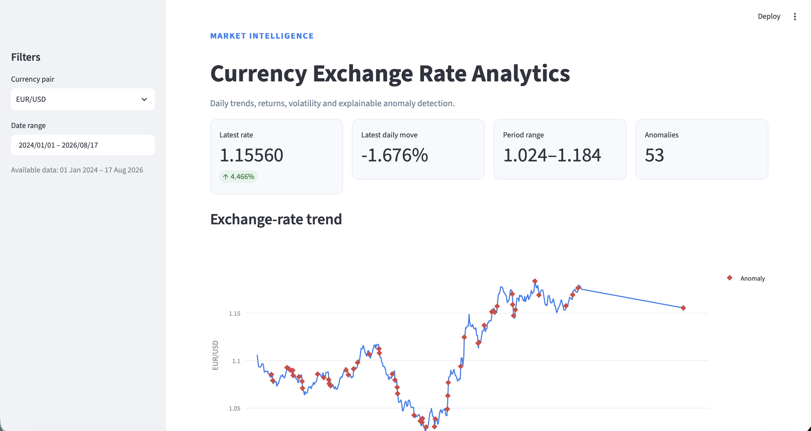
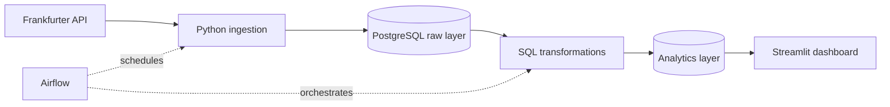

# Currency Exchange Rate Analytics Platform

An end-to-end data pipeline that ingests exchange-rate data from the
Frankfurter API, validates and stores it in PostgreSQL, builds analytical
datasets with SQL, and orchestrates daily processing with Apache Airflow.



## Key Features

- Historical backfills and scheduled daily ingestion
- Idempotent PostgreSQL upserts using a compound business key
- Schema and data-quality validation before loading
- Transactional SQL transformations for returns, rolling volatility, and anomalies
- Three-stage Airflow workflow with retries and final quality checks
- Interactive Streamlit dashboard with currency-pair and date filters
- Reproducible PostgreSQL and Airflow services through Docker Compose

## Verified Results

- Loaded 3,655 historical exchange-rate observations into PostgreSQL
- Verified idempotent reloads against the raw-layer business key
- Built four SQL analytical models for returns, volatility, and anomalies
- Completed scheduled and parameterised Airflow runs with all three tasks passing
- Passed 56 automated tests

## Architecture



Docker Compose provides the PostgreSQL and Airflow environment. The Streamlit
dashboard runs locally and connects to PostgreSQL through its mapped port.

## How the Pipeline Works

1. Python requests a single date or historical range from Frankfurter API v2.
2. Schema and business-rule checks reject malformed or invalid observations.
3. PostgreSQL upserts validated records into the raw layer.
4. Four SQL models refresh clean rates, returns, rolling volatility, and
   anomaly layers in dependency order.
5. Airflow checks expected currency coverage, matching analytical row counts,
   and the absence of invalid raw rates.
6. Streamlit queries the analytical tables for interactive exploration.

Detailed implementation notes are available in
[the pipeline workflow](docs/pipeline_workflow.md) and
[the data model](docs/data_model.md).

## Engineering Decisions

### Idempotent raw ingestion

Raw observations use `(rate_date, base_currency, quote_currency, source)` as
their business key. Reprocessing the same date updates the existing observation
instead of creating duplicate records.

### Transactional analytics refresh

The analytics models refresh in dependency order within one database
transaction. If any SQL transformation fails, the complete refresh is rolled
back to avoid partially updated analytical tables.

### Data quality as a pipeline gate

The final Airflow task verifies expected currency coverage, consistent row
counts across analytical layers, and the absence of invalid raw rates. A run is
not marked successful when these checks fail.

### Explainable anomaly detection

Anomalies are calculated using a z-score against the previous 30 non-null
returns. The current observation is excluded from its own baseline to prevent
data leakage.

### Non-publication dates

Frankfurter does not publish reference rates on weekends and some public
holidays. When the API returns no observations, the ingestion task is marked as
skipped and downstream work is skipped as well, so an expected absence of new
rates is not reported as a pipeline failure.

## Technology Stack

- Python 3.12, pandas, Requests, SQLAlchemy
- PostgreSQL 16 and transactional SQL models
- Apache Airflow 3 for scheduling and orchestration
- Streamlit and Plotly for the dashboard
- Docker Compose for PostgreSQL and Airflow services
- Pytest and Ruff in GitHub Actions

## Local Setup

### Requirements

- Python 3.12
- Docker Desktop
- Docker Compose

### 1. Clone and configure the project

```bash
git clone https://github.com/BohanDun/Currency-Exchange-Rate-Analytics-Platform.git
cd Currency-Exchange-Rate-Analytics-Platform
cp .env.example .env
```

Replace the example passwords and Airflow secrets in `.env` before starting
the services. The example uses `POSTGRES_HOST=localhost` for locally executed
Python and Streamlit processes; Compose overrides this with `postgres` inside
the Airflow containers.

### 2. Create the Python environment

```bash
python3.12 -m venv .venv
source .venv/bin/activate
python -m pip install --upgrade pip
python -m pip install -r requirements.txt
```

### 3. Start PostgreSQL

```bash
docker compose up -d --wait postgres
```

### 4. Run the verified historical backfill

```bash
python -m src.pipeline --start-date 2024-01-01 --end-date 2025-12-31
```

### 5. Start the dashboard

```bash
streamlit run dashboard/streamlit_app.py
```

Open `http://localhost:8501`. The dashboard includes headline metrics, rate
trends, daily returns, 7/30-observation rolling volatility, and
prior-30-observation anomaly scores.

## Testing

Run the automated suite:

```bash
python -m pytest
```

Run the same static checks used by CI after installing Ruff:

```bash
python -m pip install "ruff==0.12.11"
ruff check src dashboard dags tests
ruff format --check src dashboard dags tests
```

## Airflow

Initialize Airflow after the first build:

```bash
docker compose build airflow-init
docker compose up airflow-init
```

Start PostgreSQL and the Airflow services:

```bash
docker compose up -d --wait \
  postgres \
  airflow-api-server \
  airflow-scheduler \
  airflow-dag-processor
```

Open `http://localhost:8080` and sign in with `AIRFLOW_ADMIN_USERNAME` and
`AIRFLOW_ADMIN_PASSWORD` from `.env`. Enable the
`exchange_rate_analytics_daily` DAG for its 06:00 Pacific/Auckland schedule.

To reprocess a specific publication date, trigger the DAG with:

```json
{"run_date": "2025-01-03"}
```


## Project Structure

```text
.
├── .github/workflows/      # Continuous integration
├── dags/                   # Airflow DAG
├── dashboard/              # Streamlit application and SQL queries
├── data/                   # Local raw and sample-data location
├── docs/                   # Architecture notes and screenshots
├── notebooks/              # Exploratory analysis
├── sql/
│   ├── ddl/                # Database schema definitions
│   └── transformations/    # Analytics transformations
├── src/
│   ├── database/           # Database connection helpers
│   ├── ingestion/          # API extraction and loading
│   ├── transformation/     # SQL execution
│   ├── utils/              # Configuration and logging
│   └── validation/         # Data-quality rules
└── tests/                  # Automated tests
```

## Current Limitations

- The dashboard runs locally rather than as a Docker Compose service.
- Frankfurter publishes reference rates only on business days; scheduled runs
  with no new observations are skipped rather than backfilling the most recent
  publication date.
- Analytics tables use a transactional full refresh, which suits the current
  dataset but would need an incremental strategy at larger scale.
- Authentication, cloud deployment, forecasting, and alerting are outside the
  current project scope.

## Data Source

Exchange-rate observations come from the
[Frankfurter API](https://frankfurter.dev/), with `EUR` as the base currency
and `USD`, `GBP`, `NZD`, `AUD`, and `JPY` as quote currencies.

## License

No license file is currently included. All rights are reserved unless a license
is added to the repository.
