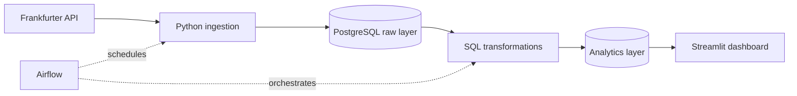

# Currency Exchange Rate Analytics Platform

An end-to-end data engineering project that extracts exchange-rate data from the
Frankfurter API, stores it in PostgreSQL, builds analytical datasets with SQL,
orchestrates the pipeline with Airflow, and presents the results in Streamlit.

## MVP scope

- Base currency: `EUR`
- Quote currencies: `USD`, `GBP`, `NZD`, `AUD`, `JPY`
- Historical backfill plus daily incremental ingestion
- Analytics: daily return, 7/30-day rolling volatility, anomaly flags
- Interactive filters for currency pair and date range
- Local one-command environment with Docker Compose

Authentication, cloud deployment, forecasting, and alerting are outside the
first MVP.

## Architecture



## Project structure

```text
.
├── docker-compose.yml      # Local services
├── requirements.txt        # Python dependencies
├── dags/                   # Airflow DAG
├── dashboard/              # Streamlit application and SQL queries
├── data/                   # Local raw and version-controlled sample data
├── docs/                   # Architecture, data model, and screenshots
├── notebooks/              # Exploratory analysis
├── sql/
│   ├── ddl/                # Database schema definitions
│   └── transformations/    # Analytics transformations
├── src/
│   ├── database/           # Database connection helpers
│   ├── ingestion/          # API extraction and loading
│   ├── transformation/     # SQL execution
│   ├── utils/              # Configuration and logging
│   └── validation/         # Data-quality rules
└── tests/                  # Automated tests
```

Portfolio images such as `architecture_diagram.png` and dashboard screenshots
will be generated from the working system near the end of the project. They are
not represented by fake placeholder images.

## Delivery stages

- [x] 1. Define the MVP and scaffold the repository
- [x] 2. Build and test API ingestion
- [x] 3. Add PostgreSQL storage and idempotent loading
- [x] 4. Add validation and data-quality checks
- [x] 5. Build SQL analytical models
- [ ] 6. Build the Streamlit dashboard
- [ ] 7. Automate the pipeline with Airflow
- [ ] 8. Complete Docker integration, tests, and portfolio documentation

## Status

Stages 1-5 are implemented and covered by automated tests. Live API ingestion
has been verified. PostgreSQL integration is ready for container testing once
Docker is available. The next implementation task is the Streamlit dashboard.
